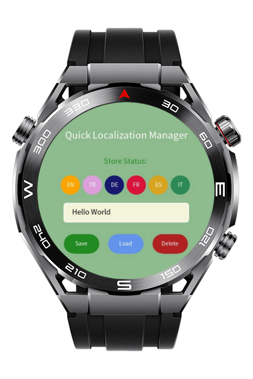

> **Note:** To access all shared projects, get information about environment setup, and view other guides, please visit [Explore-In-HMOS-Wearable Index](https://github.com/Explore-In-HMOS-Wearable/hmos-index).

# Quick Localization Manager

HarmonyOS application that allows users to dynamically switch between multiple interface languages (English, Turkish, German, French, Spanish, and Italian) in real time using a simple localization manager.

# Preview

<p align="left">
  
</p>

# Use Cases

- Real-time language switching across six supported languages  
- Dynamic UI updates for titles, buttons, and status messages  
- Localized storage messages for saving, loading, and deleting notes  
- Simple note input and management interface

# Tech Stack

- **Languages**: JavaScript  
- **Frameworks**: HarmonyOS SDK 4.0.0(10)  
- **Tools**: DevEco Studio Vers 5.1.0.842  
- **Libraries**: @ohos.i18n (custom translation logic used)

# Directory Structure

```
entry/src/main/js/MainAbility
│    pages/
│     └── index.css
│     └── index.hml
│     └── index.js
└──  i18n
├── en-US.json
└── zh-CN.json
└──  app.js
```

# Constraints and Restrictions

## Supported Devices

- Huawei Lite Wearable  
- HarmonyOS-compatible devices supporting JS UI pages

# LICENSE

Quick Localization Manager is distributed under the terms of the **MIT License**.  
See the [LICENSE](/LICENSE) file for more information.
